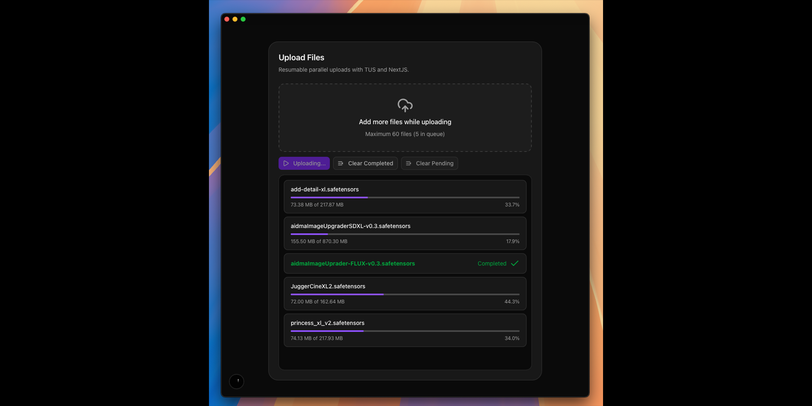

# NextJS TUS - Advanced Resumable File Upload System

A production-ready, high-performance file upload system built with Next.js 15 and the TUS (Tus Resumable Upload) protocol. This implementation provides enterprise-grade features including parallel multipart uploads, intelligent stream management, and robust error handling.

## 🚀 Key Features

### Core Upload Capabilities
- **Resumable Uploads**: Built on the TUS protocol for reliable, resumable file transfers
- **Parallel Processing**: Intelligent multipart upload system with dynamic stream allocation
- **Large File Support**: Handles files up to 20GB with configurable chunk sizes
- **Real-time Progress**: Accurate progress tracking with byte-level precision
- **Queue Management**: Advanced file queue with batch processing and stream optimization

### Advanced Architecture
- **Dynamic Stream Management**: Knapsack algorithm for optimal concurrent upload distribution
- **Multipart Assembly**: Sophisticated file reconstruction from parallel upload parts
- **Extensible Filename Strategies**: Pluggable system for custom filename handling
- **Duplicate Prevention**: Configurable duplicate file handling with multiple strategies
- **Error Recovery**: Automatic retry mechanisms with exponential backoff

### User Experience
- **Drag & Drop Interface**: Modern, responsive file upload UI
- **Live Upload Monitoring**: Real-time status updates and progress visualization
- **Batch Operations**: Upload multiple files simultaneously with intelligent batching
- **Interactive Controls**: Start, pause, cancel, and manage uploads dynamically

## 📸 Interface Preview



*Modern drag-and-drop interface with real-time progress tracking and queue management*

## 🏗️ Architecture Overview

### Frontend Components
- **[`TusFileUpload.tsx`](components/upload/TusFileUpload.tsx)**: Main upload interface with drag-drop support
- **[`useTusFileUpload.ts`](hooks/upload/useTusFileUpload.ts)**: Core upload logic and state management
- **UI Components**: Modern interface built with Radix UI and Tailwind CSS

### Backend Infrastructure
- **[`route.ts`](app/api/upload/[[...params]]/route.ts)**: TUS protocol implementation (POST, PATCH, HEAD, OPTIONS)
- **[`tus-multipart-manager.ts`](lib/upload/services/tus-multipart-manager.ts)**: Parallel upload coordination and file assembly
- **[`tus-file-operations.ts`](lib/upload/services/tus-file-operations.ts)**: File system operations and metadata management

### Intelligent Upload System
- **Stream Optimization**: Dynamic allocation of concurrent upload streams based on file size
- **Batch Processing**: Knapsack algorithm for optimal file batching within stream limits
- **Progress Aggregation**: Accurate progress calculation across multiple parallel parts
- **Assembly Pipeline**: Seamless reconstruction of multipart uploads

## 🔧 Technical Implementation

### TUS Protocol Compliance
Full implementation of the TUS resumable upload protocol with:
- **Creation Extension**: File upload initialization with metadata
- **Core Protocol**: Resumable upload with offset tracking
- **Termination Extension**: Upload cancellation and cleanup

### Multipart Upload Strategy
```typescript
// Intelligent part calculation based on file size
const getPartCount = (fileSize: number): number => {
  if (fileSize <= 50 * 1024 * 1024) return 1;        // ≤50MB: single part
  if (fileSize <= 500 * 1024 * 1024) return 4;       // ≤500MB: 4 parts
  if (fileSize <= 2 * 1024 * 1024 * 1024) return 8;  // ≤2GB: 8 parts
  return 16;                                          // >2GB: 16 parts
};
```

### Stream Management Algorithm
- **Knapsack Optimization**: Maximizes concurrent streams while respecting limits
- **Dynamic Batching**: Continuously processes new files during active uploads
- **Resource Allocation**: Intelligent distribution of upload bandwidth

### Filename Strategy System
Extensible filename handling with multiple strategies:
- **Default**: Uses unique upload IDs
- **Original**: Preserves original filenames with sanitization
- **Custom**: Pluggable system for custom naming conventions

## 📁 Project Structure

```
├── app/
│   ├── api/upload/[[...params]]/route.ts    # TUS protocol endpoints
│   ├── layout.tsx                           # App layout with styling
│   └── page.tsx                             # Main upload page
├── components/
│   ├── ui/                                  # Reusable UI components
│   └── upload/TusFileUpload.tsx             # Main upload component
├── hooks/
│   └── upload/useTusFileUpload.ts           # Upload logic hook
├── lib/
│   └── upload/
│       ├── config/tus-upload-config.ts      # Configuration settings
│       ├── services/                        # Core upload services
│       ├── types/upload-types.ts            # TypeScript definitions
│       └── utils/                           # Utility functions
└── styles/globals.css                       # Global styling
```

## ⚙️ Configuration

### Client Configuration
```typescript
export const TUS_CLIENT_CONFIG = {
  maxFileSelection: 60,                      // Maximum files in queue
  endpoint: '/api/upload/',                  // Upload endpoint
  chunkSize: 8 * 1024 * 1024,              // 8MB chunks
  retryDelays: [0, 1000, 3000, 5000],       // Retry intervals
  maxStreamCount: 8,                        // Concurrent streams
  withFilename: "original",                 // Filename strategy
  onDuplicate: "prevent",                   // Duplicate handling
  destinationPath: ""                       // Upload destination
};
```

### Server Configuration
```typescript
export const TUS_SERVER_CONFIG = {
  stagingDir: './staging',                  // Temporary upload directory
  mountPath: './uploads',                   // Final upload destination
  maxFileSize: 20 * 1024 * 1024 * 1024,   // 20GB limit
  filenameSanitizeRegex: /[^a-zA-Z0-9._-]/g // Filename sanitization
};
```

## 🚦 Getting Started

### Prerequisites
- Node.js 18+ 
- npm, yarn, pnpm, or bun

### Installation & Setup
```bash
# Clone the repository
git clone <repository-url>
cd NextJS-TUS

# Install dependencies
npm install

# Start development server
npm run dev
```

### Environment Variables (Optional)
```bash
STAGING_DIR=./staging          # Temporary upload directory
MOUNT_PATH=./uploads          # Final upload destination
```

### Usage
1. Open [http://localhost:3000](http://localhost:3000)
2. Drag and drop files or click to browse
3. Click "Upload" to start the upload process
4. Monitor progress and manage uploads in real-time

## 🎯 What Makes This Implementation Special

### 1. **Production-Ready Architecture**
- Comprehensive error handling and recovery
- Memory-efficient streaming for large files
- Robust file system operations with fallbacks

### 2. **Advanced Upload Intelligence**
- Dynamic stream allocation based on file characteristics
- Optimal batching using knapsack algorithm
- Real-time adaptation to changing upload conditions

### 3. **Extensible Design**
- Pluggable filename and duplicate handling strategies
- Modular service architecture for easy customization
- Type-safe implementation with comprehensive TypeScript support

### 4. **Enterprise Features**
- Configurable upload limits and restrictions
- Detailed logging and monitoring capabilities
- Scalable multipart upload system

### 5. **Modern Development Stack**
- Next.js 15 with App Router
- React 19 with modern hooks
- Tailwind CSS with Radix UI components
- Full TypeScript implementation

## 🔄 Upload Flow

1. **File Selection**: Users select files via drag-drop or file browser
2. **Queue Management**: Files are added to an intelligent upload queue
3. **Batch Optimization**: System calculates optimal upload batches
4. **Parallel Processing**: Files are uploaded using multipart strategy when beneficial
5. **Progress Tracking**: Real-time progress updates with byte-level accuracy
6. **Assembly**: Multipart uploads are seamlessly reconstructed
7. **Finalization**: Files are moved to final destination with proper naming

## 🛠️ Customization

### Adding Custom Filename Strategies
```typescript
registerFilenameStrategy('custom', (meta, uploadId) => {
  return `${Date.now()}_${meta.filename}`;
});
```

### Adding Custom Duplicate Handlers
```typescript
registerDuplicateStrategy('timestamp', (filename, directory) => {
  const ext = path.extname(filename);
  const base = path.basename(filename, ext);
  return `${base}_${Date.now()}${ext}`;
});
```

## 📊 Performance Characteristics

- **Throughput**: Optimized for high-bandwidth scenarios with parallel uploads
- **Memory Usage**: Streaming implementation minimizes memory footprint
- **Scalability**: Handles concurrent uploads from multiple users
- **Reliability**: Resumable uploads survive network interruptions

## 🔒 Security Features

- **Filename Sanitization**: Prevents directory traversal attacks
- **File Type Validation**: Configurable file type restrictions
- **Size Limits**: Enforced file size limitations
- **Path Validation**: Secure destination path handling

## 📈 Future Enhancements

- Cloud storage integration (AWS S3, Google Cloud, Azure)
- Advanced file type validation and virus scanning
- Upload analytics and monitoring dashboard
- WebSocket-based real-time notifications
- Distributed upload coordination for horizontal scaling

---

This implementation represents a comprehensive, production-ready file upload solution that combines the reliability of the TUS protocol with modern web development practices and intelligent upload optimization algorithms.
